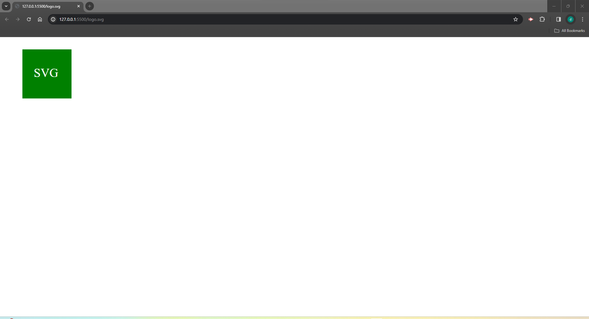

# logoGenerator / SVG

  ## Description
  In this project I used Node.js to generate a logo and save it as an SVG file, with testing and walk through.
  

  ## Table of Contents
  * [Installation](#installation)
  * [preview](#preview)
  * [License](#license)
  * [Frameworks and Libraries](#frameworks-and-libraries)
  * [Usage](#usage)
  * [Contributing](#contributing)
  * [Tests](#tests)
  * [Questions](#questions)
  * [Credits](#credits)
  

  ## Preview
   
   

  ## Installation
   To execute this application follow the GitHub link and copy the code into a new repo in your personal terminal.
   

   
   ## License

This project is licensed under the MIT license. See the [LICENSE](LICENSE) file for details.
   
   

  ## Frameworks and Libraries
   JavaScript,node.js
   

  ## Usage
  You can use this application to create a logo with three charaters and the option of three shapes. 
  

  ## Tests
  The application can be tested throught hte npm function on your terminal after installations.
  

  ## Questions
  If you have any questions feel free to reach out to me on GitHub
  

  ## Credits
   MSU
   

  ## Author
    Dan Hengel